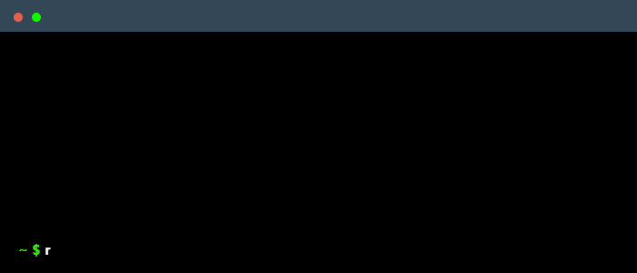
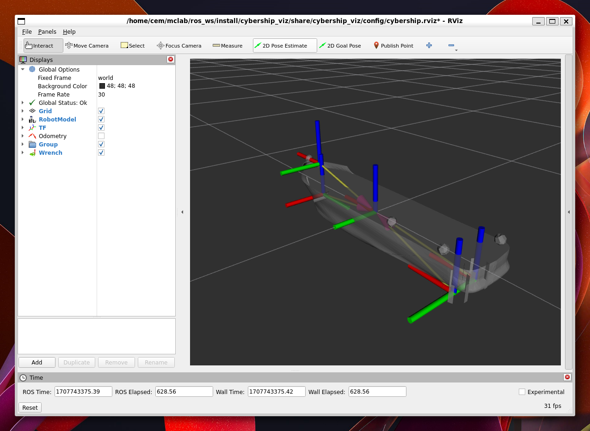

# CyberShip Enterprise Software Suite

This software suite designed for to be used as a course material. It should not
be taken as a basis for other projects as the software might change for the
vehicle.
<!--
## Crash course!

Do take a look at the [Jupyter Notebooks inside](notebooks) and the code inside of the [`example_dummy`](example_dummy) package. -->

## Installation

> This package is designed for Python 3, [ROS Jazzy](https://docs.ros.org/en/jazzy/index.html), and [Ubuntu 24.04 (Noble)](https://releases.ubuntu.com/noble/).
Before proceeding with the packages, please follow the [installations for ROS](https://docs.ros.org/en/humble/Installation.html) and
python.

1. Create a workspace
    ```bash
    mkdir -p ~/ros_ws/src
    ```

1. Clone the repository inside the workspace
    ```bash
    git clone https://github.com/NTNU-MCS/TMR4243_LAB.git ~/ros_ws/src
    ```

1. Clone the `cybership_software_suite` repository inside the workspace
    ```bash
    git clone https://github.com/NTNU-MCS/cybership_software_suite.git ~/ros_ws/src
    ```

1. Install ROS dependencies
    ```bash
    rosdep install --from-paths src --ignore-src -r -y
    ```

1. After installation, install the required python packages.
    ```bash
    sudo apt install python3-numpy python3-scipy
    ```

    Note: On Ubuntu 24, python packages are now installed with `apt`, and most packages can be found with `python3-` prefix.

1. If there is any problem with the instructions, [create a github issue](https://github.com/NTNU-MCS/TMR4243_LAB/issues/new).

## Quick Start


```bash
ros2 launch tmr4243_utilities utilities.simulation.launch.py
```

See the simulation


## Topics

- **topic**: `/CSEI/control/eta`

  **type**: `std_msgs/msg/Float32Multiarray`

  **description**: Holds the navigation data for the vehicle. Position and
  orientation

  $\eta = [x, y, \psi]^\top$

- **topic**: `/CSEI/control/u_cmd`

  **type**: `std_msgs/msg/Float64MultiArray`

  **description**: Control inputs for the actuators. It can be published by
  teleop node or your custom control node.

  $u_{cmd} = [u_0, u_1, u_2, \alpha_1, \alpha_2]^\top$

  - $u_0 \in [-1, 1]$, Controls the force of the tunnel thruster
  - $u_1 \in [0, 1]$, Controls the force of the port VSP thruster
  - $u_2 \in [0, 1]$, Controls the force of the starboard VSP thruster
  - $\alpha_1 \in [-\pi, \pi]$, Controls the force direction for port VSP thruster
  - $\alpha_2 \in [-\pi, \pi]$, Controls the force direction for starboard VSP thruster

- **topic**: `/CSEI/control/tau`

  **type**: `std_msgs/msg/Float64MultiArray`

  **description**: body fixed force. It is published by the simulator.

  $\tau = [F_x, F_y, M_z]^\top$

- **topic**: `/joy`

  **type**: `sensor_msgs/msg/Joy`

  **description**: Joystick inputs

## Custom Messages

- `tmr4243_interfaces/msg/observer.msg`
    ```
    float64[] eta
    float64[] nu
    float64[] bias
    ```
- `tmr4243_interfaces/msg/reference.msg`
    ```
    float64[] eta_d
    float64[] eta_ds
    float64[] eta_ds2
    float64 w
    float64 v_s
    float64 v_ss
    ```
- `tmr4243_interfaces/msg/s.msg`
    ```
    float64 s
    float64 s_dot
    ```

## Glossary of variables

- $\eta \rightarrow$ State variable
- $u \rightarrow$ Control command
- $\tau \rightarrow$ Body fixed force
